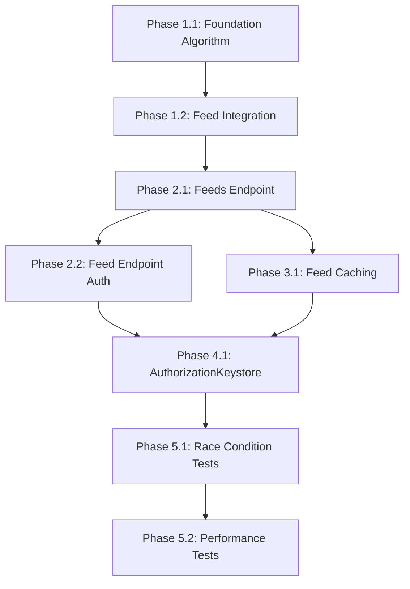

# Comprehensive Test-Driven Implementation Plan: Specification Intersection Design

## Overview

This implementation plan delivers the specification intersection solution for GitHub issue #149 through a systematic 5-phase, test-driven approach spanning both jinaga.js and jinaga-server repositories.

**Total Timeline**: 7-9 weeks
**Core Innovation**: Mathematical specification intersection eliminates runtime authorization checks, preventing 403 errors by pre-computing user-specific feeds with embedded distribution conditions.

---

## Phase 1: Core Specification Intersection Algorithm (jinaga.js)

### Phase 1.1: Foundation Algorithm Implementation
**Timeline**: Week 1-2 | **Project**: jinaga.js

#### Objectives
Implement core `intersectSpecificationWithDistributionRule()` method that mathematically combines specifications with distribution rules.

#### Implementation Tasks
1. Add `intersectSpecificationWithDistributionRule(specification, distributionRule)` method to [`DistributionEngine`](../jinaga.js/src/distribution/distribution-engine.ts)
2. Implement algorithm:
   - Add distribution user as new given
   - Create existential condition from distribution rule
   - Add path condition equating projected user with distribution user
3. Add comprehensive unit tests

#### Test Requirements
```javascript
describe('intersectSpecificationWithDistributionRule', () => {
  it('adds distribution user given to specification', () => {
    // Test that new given is added with correct type
  });
  
  it('creates existential condition from distribution rule', () => {
    // Test condition structure and logic
  });
  
  it('adds path condition equating users', () => {
    // Test user equivalence constraint
  });
  
  it('preserves original specification semantics when condition satisfied', () => {
    // Test mathematical correctness
  });
  
  it('returns empty results when distribution condition fails', () => {
    // Test graceful failure behavior
  });
});
```

#### Acceptance Criteria
- [ ] Method correctly adds distribution user given
- [ ] Existential condition properly structured with distribution rule
- [ ] Path condition correctly equates projected and distribution users
- [ ] All unit tests pass with 100% code coverage
- [ ] Method handles edge cases (empty specs, invalid rules)

#### Risk Assessment
- **Risk**: Complex existential condition logic
- **Mitigation**: Extensive unit testing with edge cases
- **Rollback**: Feature flag for algorithm enable/disable

---

### Phase 1.2: Feed Integration Method
**Timeline**: Week 2-3 | **Project**: jinaga.js

#### Objectives
Implement `intersectDistributionRules()` method that processes all distribution rules for a given specification.

#### Implementation Tasks
1. Add `intersectDistributionRules(specification, distributionUser)` method
2. Implement logic:
   - Find all feeds of input specification
   - Find matching distribution rules for each feed skeleton
   - Compute intersection for each matching rule
   - Return distinct intersected feeds
3. Add integration tests

#### Test Requirements
```javascript
describe('intersectDistributionRules', () => {
  it('finds all feeds for input specification', () => {
    // Test feed discovery logic
  });
  
  it('matches distribution rules to feed skeletons', () => {
    // Test rule matching algorithm
  });
  
  it('computes intersections for all matching rules', () => {
    // Test batch intersection processing
  });
  
  it('returns distinct intersected feeds', () => {
    // Test deduplication logic
  });
  
  it('handles specifications with no matching rules', () => {
    // Test empty result case
  });
});
```

#### Acceptance Criteria
- [ ] Method correctly identifies all relevant feeds
- [ ] Distribution rule matching works for complex specifications
- [ ] Intersection computation produces mathematically correct results
- [ ] Deduplication eliminates identical feeds
- [ ] Performance acceptable for typical rule sets (<100ms)

#### Dependencies
- Phase 1.1 must be complete and tested

---

## Phase 2: HTTP Layer Integration (jinaga-server)

### Phase 2.1: Feeds Endpoint Modification
**Timeline**: Week 3-4 | **Project**: jinaga-server

#### Objectives
Modify [`HttpRouter.feeds()`](src/http/router.ts) endpoint to use intersected distribution rules instead of runtime authorization checks.

#### Implementation Tasks
1. Update feeds endpoint in [`HttpRouter`](src/http/router.ts:517-544)
2. Replace current authorization logic with intersection calls
3. Cache intersected feeds with distribution user
4. Add endpoint integration tests

#### Test Requirements
```javascript
describe('HttpRouter.feeds endpoint', () => {
  it('calls intersectDistributionRules with correct parameters', () => {
    // Test method invocation
  });
  
  it('caches feeds with distribution user included', () => {
    // Test caching behavior
  });
  
  it('returns intersected feeds in correct format', () => {
    // Test response structure
  });
  
  it('handles users with no distribution rules', () => {
    // Test empty intersection case
  });
  
  it('maintains backward compatibility', () => {
    // Test existing client compatibility
  });
});
```

#### Acceptance Criteria
- [ ] Feeds endpoint successfully uses intersection method
- [ ] Feed caching includes distribution user context
- [ ] Response format unchanged for client compatibility
- [ ] Performance equal to or better than current implementation
- [ ] No 403 errors for feeds with missing starting facts

---

### Phase 2.2: Feed Endpoint Authorization Changes
**Timeline**: Week 4-5 | **Project**: jinaga-server

#### Objectives
Modify [`HttpRouter.feed()`](src/http/router.ts:517-544) endpoint to verify distribution user match instead of calling `canDistributeToAll`.

#### Implementation Tasks
1. Remove `canDistributeToAll` calls from feed endpoint
2. Add distribution user verification logic
3. Ensure 403 only for actual authorization failures (user mismatch)
4. Add comprehensive endpoint tests

#### Test Requirements
```javascript
describe('HttpRouter.feed endpoint authorization', () => {
  it('verifies request user matches cached feed distribution user', () => {
    // Test user matching logic
  });
  
  it('throws Forbidden only for user mismatches', () => {
    // Test actual authorization failures
  });
  
  it('never throws Forbidden for missing starting facts', () => {
    // Test race condition resolution
  });
  
  it('maintains feed streaming for empty initial results', () => {
    // Test persistent connection behavior
  });
});
```

#### Acceptance Criteria
- [ ] No `canDistributeToAll` calls in feed endpoint
- [ ] Distribution user verification prevents unauthorized access
- [ ] Missing starting facts return empty results, not 403 errors
- [ ] Feed streaming works correctly with empty initial results
- [ ] Race condition scenarios pass (both test scenarios from issue #149)

#### Dependencies
- Phase 2.1 must be complete

---

## Phase 3: Feed Caching Updates (jinaga-server)

### Phase 3.1: FeedObject Schema Enhancement
**Timeline**: Week 5 | **Project**: jinaga-server

#### Objectives
Update feed caching to store distribution user with each cached feed.

#### Implementation Tasks
1. Extend `FeedObject` interface to include `distributionUser` property
2. Update feed cache storage and retrieval logic
3. Add cache invalidation for distribution user changes
4. Add caching integration tests

#### Test Requirements
```javascript
describe('Feed caching with distribution users', () => {
  it('stores distribution user with cached feeds', () => {
    // Test cache storage enhancement
  });
  
  it('retrieves feeds filtered by distribution user', () => {
    // Test cache retrieval logic
  });
  
  it('invalidates cache when distribution rules change', () => {
    // Test cache invalidation
  });
  
  it('handles multiple users with same specification', () => {
    // Test per-user caching
  });
});
```

#### Acceptance Criteria
- [ ] `FeedObject` schema includes distribution user
- [ ] Cache correctly stores and retrieves per-user feeds
- [ ] Cache invalidation works for distribution rule changes
- [ ] Memory usage remains reasonable with per-user caching
- [ ] Cache hit rates maintain acceptable performance

#### Dependencies
- Phase 2.1 must be complete

---

## Phase 4: Authorization Layer Changes (jinaga-server)

### Phase 4.1: AuthorizationKeystore Updates
**Timeline**: Week 6 | **Project**: jinaga-server

#### Objectives
Update [`AuthorizationKeystore.feed()`](src/authorization/authorization-keystore.ts:72-95) to work with pre-intersected specifications.

#### Implementation Tasks
1. Modify `AuthorizationKeystore.feed()` to handle intersected specifications
2. Remove distribution validation that causes 403 errors
3. Ensure compatibility with existing authorization patterns
4. Add authorization integration tests

#### Test Requirements
```javascript
describe('AuthorizationKeystore with intersected specifications', () => {
  it('processes intersected specifications correctly', () => {
    // Test spec handling
  });
  
  it('no longer throws Forbidden for missing starting facts', () => {
    // Test error elimination
  });
  
  it('maintains security for actual authorization violations', () => {
    // Test security preservation
  });
  
  it('works with existing authorization patterns', () => {
    // Test backward compatibility
  });
});
```

#### Acceptance Criteria
- [ ] `AuthorizationKeystore.feed()` handles intersected specs
- [ ] No 403 errors for missing starting facts
- [ ] Actual authorization violations still properly secured
- [ ] Performance impact minimal (<10% degradation)
- [ ] All existing authorization tests continue to pass

#### Dependencies
- Phases 2.1, 2.2, and 3.1 must be complete

---

## Phase 5: End-to-End Integration Testing

### Phase 5.1: Race Condition Resolution Tests
**Timeline**: Week 7 | **Project**: jinaga-server

#### Objectives
Implement comprehensive tests proving GitHub issue #149 is resolved.

#### Implementation Tasks
1. Create test scenarios from issue #149 plan
2. Implement Project/Reader/Task test model
3. Test both race condition scenarios
4. Add performance and stability tests

#### Test Requirements
```javascript
describe('GitHub Issue #149 Race Condition Resolution', () => {
  describe('Scenario 1: Reader Exists Before Subscription', () => {
    it('returns three tasks immediately when Reader exists', async () => {
      // Test immediate results
    });
    
    it('streams new tasks when added to project', async () => {
      // Test streaming behavior
    });
  });
  
  describe('Scenario 2: Reader Created After Subscription', () => {
    it('returns empty results when Reader missing', async () => {
      // Test empty initial results
    });
    
    it('streams all tasks when Reader created', async () => {
      // Test delayed streaming
    });
    
    it('continues streaming new tasks after Reader exists', async () => {
      // Test ongoing streaming
    });
  });
  
  describe('Authorization Behavior', () => {
    it('never returns 403 for feed requests with missing facts', async () => {
      // Test error elimination
    });
    
    it('maintains persistent connections for empty initial results', async () => {
      // Test connection stability
    });
  });
});
```

#### Acceptance Criteria
- [ ] Scenario 1 passes: Immediate results when Reader exists
- [ ] Scenario 2 passes: Empty results → streaming when Reader arrives
- [ ] No 403 Forbidden errors for any feed requests
- [ ] Persistent connections maintained throughout test scenarios
- [ ] Streaming behavior correct for delayed fact arrival

#### Dependencies
- All previous phases must be complete

---

### Phase 5.2: Performance and Stability Testing
**Timeline**: Week 8-9 | **Project**: jinaga-server

#### Objectives
Validate performance and stability of complete solution under realistic loads.

#### Implementation Tasks
1. Performance benchmarking vs baseline
2. Memory usage analysis with per-user caching
3. Load testing with multiple concurrent users
4. Long-running stability tests

#### Test Requirements
```javascript
describe('Performance and Stability', () => {
  it('feed response times within 10% of baseline', () => {
    // Benchmark performance
  });
  
  it('memory usage scales linearly with user count', () => {
    // Test memory characteristics
  });
  
  it('handles 100+ concurrent feed subscriptions', () => {
    // Test load handling
  });
  
  it('maintains stability over 24+ hour periods', () => {
    // Test long-term stability
  });
});
```

#### Acceptance Criteria
- [ ] Feed response times within 10% of current performance
- [ ] Memory usage scales acceptably with user count
- [ ] System handles realistic concurrent load (100+ users)
- [ ] No memory leaks over extended periods
- [ ] Connection stability maintained under load

#### Dependencies
- Phase 5.1 must be complete

---

## Risk Management

### High-Risk Areas
1. **Specification Intersection Complexity**: Mathematical correctness critical
   - **Mitigation**: Extensive unit testing, formal verification of examples
   - **Rollback**: Feature flag to disable intersection

2. **Feed Caching Memory Usage**: Per-user caching may increase memory
   - **Mitigation**: Memory usage monitoring, cache size limits
   - **Rollback**: Fallback to runtime authorization checks

3. **Authorization Security**: Ensure no security bypasses
   - **Mitigation**: Security audit, penetration testing
   - **Rollback**: Revert to original authorization patterns

### Medium-Risk Areas
1. **Performance Impact**: Intersection computation overhead
   - **Mitigation**: Performance testing, optimization if needed

2. **Integration Complexity**: Cross-project coordination
   - **Mitigation**: Clear phase dependencies, integration testing

---

## Success Criteria

### Functional Requirements
- [ ] No 403 Forbidden errors for feed requests with missing starting facts
- [ ] Empty results returned immediately for missing facts
- [ ] Persistent connections maintained throughout scenarios  
- [ ] Delayed streaming works when starting facts arrive
- [ ] Both race condition test scenarios pass consistently

### Performance Requirements
- [ ] Feed response times within 10% of current baseline
- [ ] Memory usage scales acceptably with user count
- [ ] System handles 100+ concurrent feed subscriptions

### Security Requirements
- [ ] No authorization bypasses introduced
- [ ] Actual authorization violations still properly secured
- [ ] Information leakage prevention maintained

---

## Phase Dependencies Diagram



---

## Summary

This comprehensive plan delivers a robust, test-driven solution to GitHub issue #149 through mathematical specification intersection, eliminating the race condition while maintaining system security and performance. The 5-phase approach ensures systematic progress with clear validation criteria at each step.

**Key Innovation**: By pre-computing user-specific feeds with embedded distribution conditions, the system eliminates runtime authorization checks that cause 403 errors, providing a mathematically elegant solution to the temporal race condition problem.