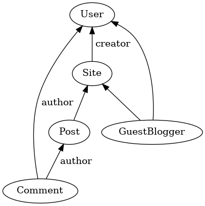
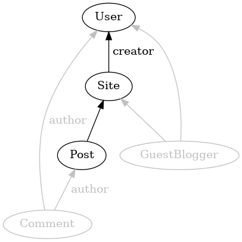
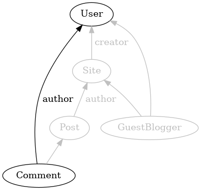
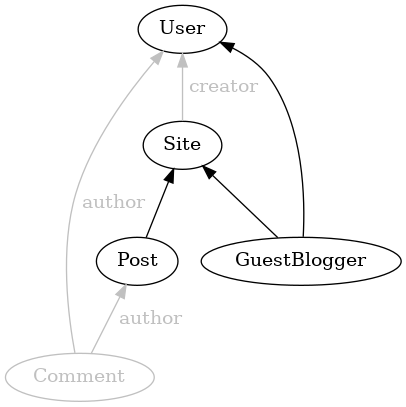

# Authorization

Authorization in Jinaga answers the question "can this user assert this fact?"
Given a fact, an authorization rule returns the set of all users who are
permitted to create it.

## The Blog Example

Let's look at an example. Suppose we have a blog application. We want to
allow the creator of the blog site to create posts. We also want to allow
anyone to create comments on posts. A comment is attributed to its author,
so we want assurance that the attributed author is the one who created
the comment.



To express the first rule, we write a specification that takes a Post and
returns the creator of the blog site.

```
(post: Post) {
  user: User [
    user = post->site: Site->creator: User
  ]
} => user
```

To express the second rule, we write a specification that takes a Comment
and returns the author of the comment.

```
(comment: Comment) {
  user: User [
    user = comment->author: User
  ]
} => user
```

## Authorization Rules

When the server receives a fact, it runs the authorization rules starting
from that fact. If the user is in the set of users returned by any of the
rules, then the user is authorized to create the fact.

So when the server receives a Post, it runs the first rule.



If the user who submitted the Post is the creator of the site, then the
fact is accepted. Otherwise, the fact is rejected.

When the server receives a Comment, it runs the second rule.



If the user who submitted the Comment is the author of the comment, then
the fact is accepted. Otherwise, the fact is rejected. This rule will
not allow a user to impersonate another user in a comment.

## Predecessors and Successors

The example rules that we examined above both start with a fact and return
predecessors. But some rules can also include successors. For example, we
might want to allow the creator of a site to invite a guest blogger. The
guest blogger would be allowed to create a Post.

The following rule allows a guest blogger to create a Post.

```
(post: Post) {
  guestBlogger: GuestBlogger [
    guestBlogger->site: Site = post->site: Site
  ]
  user: User [
    user = guestBlogger->user: User
  ]
} => user
```

It follows a path from the Post up to the Site, and then from the Site
down to the GuestBlogger. Then it bounces back up to the User.



The first step of this rule is a predecessor step. It follows the edge
from the Post that was submitted up to the Site. As we generalize over
authorization rules, we find that *all* rules must begin with a predecessor
step. If they started with a successor step, then the rule would be
unsatisfiable. The submitted fact is not yet in the database. It
certainly cannot have any successors yet.

## Splitting Rules

Taking advantage of this observation, we define the following algorithm.
The server splits each authorization rule into two halves. The first half
contains only predecessor steps. The second half contains the rest of the
steps. The server runs the first half -- the *head* -- on the transitive
closure of the submitted fact. It runs the second half -- the *tail* --
on the database.

The transitive closure of a fact includes its predecessors, all of
*their* predecessors, and so on up to the root. This guarantees that
the head can be executed on that graph. If *all* of the steps in the rule
are predecessor steps, then there is no tail, and we have the set of users with no additional work.

If there *is* a tail, then the server runs the tail on the database
starting where the head left off. The edges that the tail traverses are
likely not in the transitive closure. It therefore needs to be run on the
database.

The server cannot start the query on the database. The database does
not yet contain the submitted fact. So the server must first take at least
one predecessor step to find a good starting point. It then runs the tail
on the database starting from that point.

## Race Conditions

Authorization rules with successor steps are the source of the only
race conditions that occur in a historical model. If the server learns
about a fact before it learns about the successors in the authorization
rule, then the server will reject the fact. But if it learns about the
successors before it learns about the fact, then the server will accept
it.

This problem is compounded when an authorization rule contains a negative
existential condition. More commonly, this is known as revocation. For
example, suppose we want to allow the creator of a site to revoke the
access of a guest blogger. The rule would contain a "not exists" condition.
If the guest blogger got their post in before the revocation, then the
server would accept it. But if they waited until after the revocation,
then the server would reject it.

Race conditions like these lead to a loss of consistency. Different
replicas may see successor facts in a different order. They will therefore
reach different conclusions about the authorization of a fact.