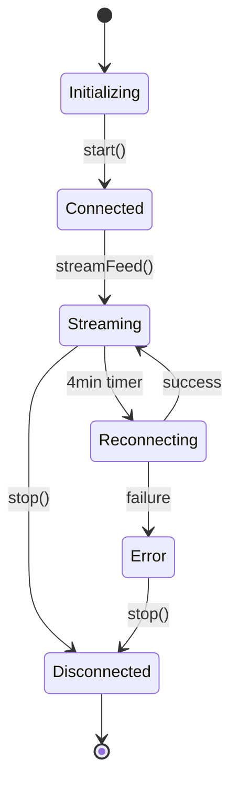

# Connection Lifecycle Management Analysis

## Executive Summary

This document provides a comprehensive analysis of connection lifecycle management in the Jinaga.js library, tracing execution flow from the `connectToFeed` entry point through all dependent connection handling mechanisms. The analysis covers connection pooling, resource allocation, error handling, timeout configurations, retry logic, cleanup procedures, and graceful shutdown behavior, with special focus on browser-specific mobile device scenarios and page visibility changes while maintaining Node.js compatibility.

## Architecture Overview

### Component Hierarchy
```
Subscriber (subscriber.ts)
    ↓
HttpNetwork (httpNetwork.ts)
    ↓
WebClient (web-client.ts)
    ↓
FetchConnection (fetch.ts)
```

### Key Connection Types
1. **Feed Streaming Connections**: Long-lived HTTP streams for real-time data
2. **HTTP Request/Response**: Standard REST API calls
3. **Authentication Connections**: Token refresh and login flows

## 1. Connection Entry Point Analysis

### `connectToFeed` Function Flow

**Location**: [`src/observer/subscriber.ts:55`](src/observer/subscriber.ts:55)

```typescript
private connectToFeed(resolve, reject) {
    return this.network.streamFeed(this.feed, this.bookmark, 
        async (envelopes) => { /* envelope handler */ },
        async (nextBookmark) => { /* bookmark handler */ },
        err => { /* error handler */ }
    );
}
```

**Key Characteristics**:
- **Connection Refresh Strategy**: 4-minute automatic reconnection cycle
- **Reference Counting**: Uses `refCount` for subscription management
- **State Management**: Tracks `resolved` state to prevent duplicate callbacks
- **Resource Cleanup**: Stores disconnect function for manual termination

### Connection Lifecycle States

1. **Initialization**: `start()` method initiates connection
2. **Active Streaming**: Continuous data flow via HTTP stream
3. **Periodic Refresh**: 4-minute timer-based reconnection
4. **Graceful Shutdown**: `stop()` method cleanup
5. **Error Recovery**: Automatic retry mechanisms

## 2. Connection Pooling and Resource Allocation

### Current Implementation Assessment

**No Explicit Connection Pooling**: The current architecture does not implement traditional HTTP connection pooling. Each feed subscription creates its own streaming connection.

**Resource Allocation Pattern**:
- **Per-Feed Connections**: Each feed gets dedicated streaming connection
- **Shared HTTP Client**: Single `FetchConnection` instance for all operations
- **AbortController Usage**: Individual controllers per request/stream

### Resource Management Issues Identified

1. **No Connection Reuse**: Each stream creates new fetch connection
2. **Potential Resource Exhaustion**: Multiple feeds = multiple persistent connections
3. **Browser Connection Limits**: May hit browser's per-domain connection limit

## 3. Timeout Configuration Analysis

### Timeout Hierarchy

| Component | Timeout Type | Duration | Configurable |
|-----------|--------------|----------|--------------|
| WebClient | Request Timeout | `config.timeoutSeconds` | ✅ Yes |
| FetchConnection (GET) | Fixed Timeout | 30 seconds | ❌ No |
| FetchConnection (POST) | Dynamic Timeout | `timeoutSeconds * 1000` | ✅ Yes |
| FetchConnection (Stream) | No Explicit Timeout | Indefinite | ❌ No |

### Timeout Implementation Details

**GET Requests** [`src/http/fetch.ts:50`](src/http/fetch.ts:50):
```typescript
const timeoutId = setTimeout(() => controller.abort(), 30000);
```

**POST Requests** [`src/http/fetch.ts:233`](src/http/fetch.ts:233):
```typescript
const timeoutId = setTimeout(() => controller.abort(), timeoutSeconds * 1000);
```

**Stream Connections**: No timeout mechanism - relies on network-level timeouts

### Timeout Issues Identified

1. **Inconsistent Timeout Handling**: Different timeout strategies across methods
2. **Stream Timeout Gap**: No application-level timeout for streaming connections
3. **Hardcoded Values**: GET timeout not configurable

## 4. Error Handling and Retry Logic

### Error Handling Layers

#### Layer 1: Network Level (fetch.ts)
- **AbortError Handling**: Converts to 408 Request Timeout
- **Network Failures**: Converts to 500 Internal Server Error
- **Authentication Errors**: 401/407/419 trigger reauthentication

#### Layer 2: HTTP Client Level (web-client.ts)
- **Retry Logic**: Exponential backoff with jitter
- **Status Code Mapping**: Success/Failure/Retry categorization
- **Content Type Negotiation**: Fallback mechanisms

#### Layer 3: Application Level (subscriber.ts)
- **Connection Refresh**: 4-minute periodic reconnection
- **State Management**: Prevents duplicate error callbacks

### Retry Strategy Analysis

**Limited Retry Implementation** [`src/http/web-client.ts:130`](src/http/web-client.ts:130):
```typescript
private async postWithLimitedRetry(path, contentType, accept, body) {
    let retrySeconds = 1;
    while (true) {
        // ... retry logic with exponential backoff
        if (retrySeconds <= 4) {
            await delay(retrySeconds + Math.random());
            retrySeconds = retrySeconds * 2;
        } else {
            throw new Error(response.error);
        }
    }
}
```

**Retry Characteristics**:
- **Maximum Attempts**: 3 retries (1s, 2s, 4s delays)
- **Exponential Backoff**: Doubles delay each attempt
- **Jitter**: Adds randomization to prevent thundering herd
- **Scope**: Only applies to POST operations with retry flag

### Error Handling Gaps

1. **Stream Error Recovery**: No automatic retry for streaming connections
2. **Partial Failure Handling**: Limited handling of partial data corruption
3. **Network State Changes**: No detection of network connectivity changes

## 5. Graceful Shutdown Analysis

### Current Shutdown Mechanisms

#### Subscriber Level Shutdown [`src/observer/subscriber.ts:44`](src/observer/subscriber.ts:44)
```typescript
stop() {
    if (this.timer) {
        clearInterval(this.timer);
        this.timer = undefined;
    }
    if (this.disconnect) {
        this.disconnect();
        this.disconnect = undefined;
    }
}
```

#### Stream Level Shutdown [`src/http/fetch.ts:178`](src/http/fetch.ts:178)
```typescript
return () => {
    closed = true;
    controller.abort();
};
```

### Shutdown Sequence Analysis

1. **Timer Cleanup**: Stops periodic reconnection timer
2. **Connection Termination**: Calls disconnect function
3. **AbortController Signal**: Cancels in-flight requests
4. **State Flag Setting**: Sets `closed = true` to prevent further operations

### Browser Close Event Handling

**Critical Gap Identified**: No explicit browser lifecycle event handlers

**Current Behavior on Browser Close/Hide**:
- Connections may remain open until browser force-closes them
- No graceful server notification of client disconnect
- Potential for server-side resource leaks
- No handling of mobile device lock/unlock scenarios
- No detection of tab visibility changes

**Missing Page Lifecycle Integration**:
- No use of Visibility API for detecting page hidden/visible states
- No use of Page Lifecycle API for detecting freeze/resume states
- No connection refresh on visibility restoration

## 6. Resource Cleanup Assessment

### Memory Leak Prevention

#### Positive Aspects
1. **Timer Cleanup**: Properly clears intervals
2. **Reference Nullification**: Sets disconnect functions to undefined
3. **AbortController Usage**: Cancels pending operations

#### Potential Issues
1. **Event Listener Cleanup**: No explicit removal of event listeners
2. **Callback References**: May retain references in closure chains
3. **Stream Reader Cleanup**: No explicit reader.releaseLock() calls

### Connection State Transitions



## 7. Browser-Specific Mobile Device and Page Visibility Considerations

### Environment Detection and Isolation

**Critical Requirement**: Browser-specific APIs must be isolated to prevent Node.js runtime errors

**Environment Detection Strategy**:
```typescript
// In Subscriber class
private isBrowserEnvironment(): boolean {
    return typeof window !== 'undefined' &&
           typeof document !== 'undefined' &&
           typeof navigator !== 'undefined';
}

private isPageVisibilitySupported(): boolean {
    return this.isBrowserEnvironment() &&
           'visibilityState' in document;
}

private isPageLifecycleSupported(): boolean {
    return this.isBrowserEnvironment() &&
           'addEventListener' in window;
}
```

### Page Visibility API Integration (Browser Only)

**Current Gap**: No integration with the [Page Visibility API](https://developer.mozilla.org/en-US/docs/Web/API/Page_Visibility_API)

**Mobile Device Scenarios** (Browser Context Only):
1. **Phone Lock/Unlock**: When users lock their phone, the page becomes hidden; when unlocked, it becomes visible
2. **App Switching**: Moving between apps triggers visibility changes
3. **Background Tab**: Switching tabs changes visibility state
4. **System Sleep**: Device sleep modes affect page visibility

**Recommended Implementation with Environment Isolation**:
```typescript
// In Subscriber class
private visibilityChangeHandler = () => {
    if (!this.isBrowserEnvironment()) return;
    
    if (document.visibilityState === 'visible') {
        // Page became visible - refresh connection
        this.refreshConnection();
    } else if (document.visibilityState === 'hidden') {
        // Page became hidden - consider connection cleanup
        this.handlePageHidden();
    }
};

private setupVisibilityHandling() {
    if (!this.isPageVisibilitySupported()) {
        return; // Skip in Node.js or unsupported browsers
    }
    
    document.addEventListener('visibilitychange', this.visibilityChangeHandler);
}

private refreshConnection() {
    if (this.disconnect) {
        this.disconnect();
    }
    this.disconnect = this.connectToFeed(this.resolveCallback, this.rejectCallback);
}

private cleanupVisibilityHandling() {
    if (!this.isPageVisibilitySupported()) {
        return;
    }
    
    document.removeEventListener('visibilitychange', this.visibilityChangeHandler);
}
```

### Page Lifecycle API Integration (Browser Only)

**Current Gap**: No integration with the [Page Lifecycle API](https://developer.mozilla.org/en-US/docs/Web/API/Page_Lifecycle_API)

**Lifecycle States to Handle** (Browser Context Only):
- **Active**: Page is visible and has input focus
- **Passive**: Page is visible but doesn't have input focus
- **Hidden**: Page is not visible (backgrounded, minimized, or on another tab)
- **Frozen**: Page is hidden and its task queues are suspended
- **Terminated**: Page is being unloaded

**Recommended Implementation with Environment Isolation**:
```typescript
private pageLifecycleHandler = (event: Event) => {
    if (!this.isBrowserEnvironment()) return;
    
    switch (event.type) {
        case 'freeze':
            // Page is being frozen - cleanup connections
            this.handlePageFreeze();
            break;
        case 'resume':
            // Page is being resumed - restore connections
            this.handlePageResume();
            break;
        case 'pagehide':
            // Page is being hidden - graceful cleanup
            this.handlePageHide();
            break;
        case 'pageshow':
            // Page is being shown - restore connections
            this.handlePageShow();
            break;
    }
};

private setupPageLifecycleHandling() {
    if (!this.isPageLifecycleSupported()) {
        return; // Skip in Node.js environment
    }
    
    window.addEventListener('freeze', this.pageLifecycleHandler);
    window.addEventListener('resume', this.pageLifecycleHandler);
    window.addEventListener('pagehide', this.pageLifecycleHandler);
    window.addEventListener('pageshow', this.pageLifecycleHandler);
}

private cleanupPageLifecycleHandling() {
    if (!this.isPageLifecycleSupported()) {
        return;
    }
    
    window.removeEventListener('freeze', this.pageLifecycleHandler);
    window.removeEventListener('resume', this.pageLifecycleHandler);
    window.removeEventListener('pagehide', this.pageLifecycleHandler);
    window.removeEventListener('pageshow', this.pageLifecycleHandler);
}
```

### Connection Strategy for Mobile Devices (Browser Only)

**Optimized Mobile Connection Pattern** (Browser Context Only):
1. **Immediate Cleanup on Hide**: Close connections when page becomes hidden
2. **Fresh Connection on Show**: Establish new connection when page becomes visible
3. **Reduced Polling**: Disable polling when visibility state indicates page is hidden
4. **Battery Optimization**: Minimize background activity when hidden

**Implementation Strategy with Environment Isolation**:
```typescript
private isPageVisible(): boolean {
    if (!this.isBrowserEnvironment()) {
        return true; // Always consider visible in Node.js
    }
    return document.visibilityState === 'visible';
}

private adjustTimerForVisibility() {
    if (this.timer) {
        clearInterval(this.timer);
    }
    
    if (this.isPageVisible()) {
        // Normal 4-minute refresh when visible (or always in Node.js)
        this.timer = setInterval(() => this.reconnect(), 4 * 60 * 1000);
    } else {
        // No timer when hidden
    }
}

private getOptimalReconnectInterval(): number {
    if (!this.isBrowserEnvironment()) {
        return 4 * 60 * 1000; // Standard interval in Node.js
    }
    
    if (!this.isPageVisible()) {
        return 10 * 60 * 1000; // 10 minutes when hidden
    }
    
    if (this.isLowBattery()) {
        return 8 * 60 * 1000; // 8 minutes on low battery
    }
    
    return 4 * 60 * 1000; // 4 minutes normal
}
```

## 8. Race Condition Analysis

### Identified Race Conditions

#### 1. Timer vs Manual Disconnect Race
**Location**: [`src/observer/subscriber.ts:35-40`](src/observer/subscriber.ts:35-40)
```typescript
this.disconnect = this.connectToFeed(resolve, reject);
this.timer = setInterval(() => {
    if (this.disconnect) {
        this.disconnect();  // Race: disconnect might be called during connectToFeed
    }
    this.disconnect = this.connectToFeed(resolve, reject);
}, 4 * 60 * 1000);
```

**Risk**: Timer callback might execute during connection establishment

#### 2. Stream Close vs Read Race
**Location**: [`src/http/fetch.ts:129-138`](src/http/fetch.ts:129-138)
```typescript
const read = async () => {
    if (closed) return;  // Check 1
    try {
        const { done, value } = await reader?.read()!;  // Race: closed might be set here
        if (done) return;
        // ... processing
    }
}
```

**Risk**: Stream might be closed between check and read operation

#### 3. Authentication vs Request Race
**Location**: [`src/http/fetch.ts:24-30`](src/http/fetch.ts:24-30)
```typescript
if (response.statusCode === 401) {
    const retry = await this.reauthenticate();  // Race: multiple requests might reauthenticate
    if (retry) {
        headers = await this.getHeaders();
        response = await this.httpGet(path, headers);
    }
}
```

**Risk**: Concurrent requests might trigger multiple reauthentication attempts

## 9. Server-Side Connection Impact

### Connection Disposal Assessment

**Current Implementation Weaknesses**:
1. **No Explicit Close Notification**: Server doesn't receive clean disconnect signal
2. **Connection Timeout Dependency**: Relies on server-side timeouts
3. **Resource Cleanup Uncertainty**: No guarantee of server resource cleanup

**Potential Server-Side Issues**:
- **Hanging Connections**: Connections may remain open on server
- **Resource Exhaustion**: Accumulation of zombie connections
- **Memory Leaks**: Server-side resources not properly released

### Recommended Server-Side Mitigations
1. **Connection Heartbeat**: Implement ping/pong mechanism
2. **Idle Timeout**: Server-side connection timeout enforcement
3. **Resource Monitoring**: Track and cleanup stale connections

## 9. Browser Termination Scenarios

### Scenario Analysis

#### 1. Normal Tab Close
- **Current Behavior**: Connections abruptly terminated
- **Impact**: Server connections may hang
- **Recommendation**: Add beforeunload handler

#### 2. Browser Crash
- **Current Behavior**: No cleanup possible
- **Impact**: Server must handle via timeout
- **Recommendation**: Implement server-side heartbeat

#### 3. Network Disconnection
- **Current Behavior**: Fetch operations will timeout
- **Impact**: Connections will eventually fail
- **Recommendation**: Add network state monitoring

#### 4. System Sleep/Hibernate
- **Current Behavior**: Connections suspended
- **Impact**: May cause server-side timeouts
- **Recommendation**: Implement connection recovery on wake

## 11. Recommendations for Improvement

### High Priority

1. **Page Visibility and Lifecycle Integration (Browser Only)**
   ```typescript
   // Comprehensive page lifecycle handling with environment isolation
   private setupPageHandlers() {
       if (!this.isBrowserEnvironment()) {
           return; // Skip all browser-specific setup in Node.js
       }
       
       // Visibility API (browser only)
       if (this.isPageVisibilitySupported()) {
           document.addEventListener('visibilitychange', () => {
               if (document.visibilityState === 'visible') {
                   this.refreshConnection();
               } else {
                   this.handlePageHidden();
               }
           });
       }
       
       // Page Lifecycle API (browser only)
       if (this.isPageLifecycleSupported()) {
           window.addEventListener('freeze', () => this.handlePageFreeze());
           window.addEventListener('resume', () => this.handlePageResume());
           window.addEventListener('pagehide', () => this.stop());
           window.addEventListener('beforeunload', () => this.stop());
       }
   }
   
   private cleanupPageHandlers() {
       if (!this.isBrowserEnvironment()) {
           return;
       }
       
       this.cleanupVisibilityHandling();
       this.cleanupPageLifecycleHandling();
   }
   
   private refreshConnection() {
       if (this.disconnect) {
           this.disconnect();
       }
       this.disconnect = this.connectToFeed(this.resolveCallback, this.rejectCallback);
   }
   ```

2. **Stream Timeout Implementation**
   ```typescript
   const streamTimeout = setTimeout(() => {
       controller.abort();
   }, STREAM_TIMEOUT_MS);
   ```

3. **Connection State Synchronization**
   ```typescript
   private connectionMutex = new Mutex();
   
   async reconnect() {
       await this.connectionMutex.acquire();
       try {
           // Atomic reconnection logic
       } finally {
           this.connectionMutex.release();
       }
   }
   ```

### Medium Priority

4. **Connection Pooling**
   - Implement HTTP/2 connection reuse
   - Add connection pool management
   - Monitor connection health

5. **Enhanced Error Recovery**
   - Implement circuit breaker pattern
   - Add network state detection
   - Improve retry strategies

6. **Resource Monitoring**
   - Add connection metrics
   - Implement resource leak detection
   - Monitor memory usage

### Low Priority

7. **Performance Optimizations**
   - Implement request batching
   - Add response caching
   - Optimize stream parsing

## 12. Enhanced Mobile Device Considerations (Browser Only)

### Environment-Aware Implementation

**Critical Design Principle**: All browser-specific optimizations must be isolated from Node.js execution

### Battery Life Optimization (Browser Only)

**Current Impact**: Continuous streaming connections drain battery on mobile devices

**Optimization Strategies** (Browser Context Only):
1. **Adaptive Polling**: Reduce connection frequency when page is hidden
2. **Connection Suspension**: Pause streaming when device is locked
3. **Smart Reconnection**: Only reconnect when user interaction is detected

**Implementation Example with Environment Isolation**:
```typescript
private getOptimalReconnectInterval(): number {
    if (!this.isBrowserEnvironment()) {
        return 4 * 60 * 1000; // Standard interval in Node.js
    }
    
    if (!this.isPageVisible()) {
        return 10 * 60 * 1000; // 10 minutes when hidden
    }
    
    if (this.isLowBattery()) {
        return 8 * 60 * 1000; // 8 minutes on low battery
    }
    
    return 4 * 60 * 1000; // 4 minutes normal
}

private isLowBattery(): boolean {
    if (!this.isBrowserEnvironment()) {
        return false; // No battery concerns in Node.js
    }
    
    // Use Battery API if available (browser only)
    try {
        return (navigator as any).getBattery?.()?.level < 0.2;
    } catch {
        return false; // Fallback if Battery API unavailable
    }
}
```

### Network State Awareness (Browser Only)

**Current Gap**: No network state monitoring

**Recommended Integration with Environment Isolation**:
```typescript
private setupNetworkHandling() {
    if (!this.isBrowserEnvironment()) {
        return; // Skip network event handling in Node.js
    }
    
    window.addEventListener('online', () => {
        // Network restored - reconnect immediately
        this.refreshConnection();
    });
    
    window.addEventListener('offline', () => {
        // Network lost - cleanup connections
        this.handleNetworkOffline();
    });
    
    // Connection type awareness (browser only)
    if ('connection' in navigator) {
        try {
            (navigator as any).connection.addEventListener('change', () => {
                this.handleConnectionChange();
            });
        } catch {
            // Ignore if Connection API not supported
        }
    }
}

private cleanupNetworkHandling() {
    if (!this.isBrowserEnvironment()) {
        return;
    }
    
    window.removeEventListener('online', this.refreshConnection);
    window.removeEventListener('offline', this.handleNetworkOffline);
    
    if ('connection' in navigator) {
        try {
            (navigator as any).connection.removeEventListener('change', this.handleConnectionChange);
        } catch {
            // Ignore cleanup errors
        }
    }
}
```

### Node.js vs Browser Behavior Matrix

| Feature | Node.js Behavior | Browser Behavior |
|---------|------------------|------------------|
| Connection Interval | Fixed 4 minutes | Adaptive based on visibility |
| Page Visibility | Always "visible" | Actual visibility state |
| Battery Optimization | Not applicable | Adaptive intervals |
| Network Events | Not monitored | online/offline events |
| Lifecycle Events | Not applicable | freeze/resume/hide/show |
| Cleanup Strategy | Timer + disconnect only | Full event listener cleanup |

## 13. Conclusion

The current connection lifecycle management implementation provides basic functionality but has several critical gaps in graceful shutdown handling, race condition prevention, and resource cleanup. The most significant issues are:

1. **Lack of Page Lifecycle Integration**: No use of Visibility API or Page Lifecycle API for handling mobile device scenarios like lock/unlock, app switching, or tab changes
2. **Missing Mobile Optimization**: No battery-aware connection management or network state monitoring
3. **Inadequate Browser Event Handling**: No comprehensive event handling for clean connection termination
4. **Environment Isolation Gap**: Browser-specific APIs need proper isolation to prevent Node.js runtime errors

The 4-minute reconnection strategy provides resilience but is not optimized for mobile devices where page visibility changes frequently. The retry logic is well-implemented for POST operations but lacks coverage for streaming connections.

**Key Mobile Device Improvements Needed**:
- Connection refresh on page visibility restoration (phone unlock scenarios)
- Adaptive connection intervals based on page visibility and battery state
- Network state awareness for connection management
- Proper cleanup during page freeze/hide events
- Complete environment isolation between browser and Node.js contexts

Implementing the enhanced recommendations with Page Visibility and Lifecycle API integration would significantly improve the robustness of connection management, especially for mobile users, while maintaining full Node.js compatibility and preventing resource exhaustion scenarios.

## Appendix A: Enhanced Code Flow Diagram with Page Lifecycle

```
Page Lifecycle Events → Visibility API → Subscriber Event Handlers
         ↓                    ↓                    ↓
    freeze/resume      visibilitychange    refreshConnection()
         ↓                    ↓                    ↓
    Connection Pause   Connection Refresh   Subscriber.stop()
         ↓                    ↓                    ↓
    Resource Cleanup   Fresh Connection    HttpNetwork.streamFeed()
                              ↓                    ↓
                       WebClient.streamFeed()  FetchConnection.getStream()
                              ↓                    ↓
                       AbortController.abort()  Stream Reader Cleanup
                              ↓                    ↓
                       Connection Termination  Reference Nullification
```

## Appendix B: Enhanced Connection State Matrix with Page Visibility

| State | Timer Active | Connection Open | Disconnect Function | Page Visible | Cleanup Required |
|-------|-------------|----------------|-------------------|--------------|------------------|
| Initial | ❌ | ❌ | ❌ | ✅ | ❌ |
| Starting | ✅ | ⏳ | ⏳ | ✅ | ❌ |
| Active-Visible | ✅ | ✅ | ✅ | ✅ | ❌ |
| Active-Hidden | ⏳ | ✅ | ✅ | ❌ | ⏳ |
| Frozen | ❌ | ❌ | ❌ | ❌ | ✅ |
| Reconnecting | ✅ | ⏳ | ✅ | ✅ | ✅ |
| Stopping | ❌ | ✅ | ✅ | ⏳ | ✅ |
| Stopped | ❌ | ❌ | ❌ | ⏳ | ❌ |

Legend: ✅ = Active/Required, ❌ = Inactive/Not Required, ⏳ = Transitioning/Conditional

## Appendix C: Environment-Specific Behavior Matrix

### Browser Environment Scenarios

| Scenario | Visibility State | Recommended Action | Connection Strategy |
|----------|-----------------|-------------------|-------------------|
| Phone Lock | `hidden` | Pause/Cleanup | Suspend streaming, keep minimal polling |
| Phone Unlock | `visible` | Refresh Connection | Immediate reconnect with fresh stream |
| App Switch Out | `hidden` | Reduce Activity | Lower frequency polling |
| App Switch In | `visible` | Resume Normal | Restore normal connection pattern |
| Low Battery | `visible` | Optimize | Reduce connection frequency |
| Network Change | Any | Adapt | Reconnect with appropriate strategy |
| Background Tab | `hidden` | Minimal Activity | Reduce resource usage |
| Foreground Tab | `visible` | Full Activity | Normal connection management |

### Node.js Environment Scenarios

| Scenario | Visibility State | Recommended Action | Connection Strategy |
|----------|-----------------|-------------------|-------------------|
| Process Start | N/A (Always "visible") | Initialize | Standard 4-minute interval |
| Network Loss | N/A | Retry Logic | Standard retry with exponential backoff |
| High Load | N/A | Continue | Maintain standard connection pattern |
| Memory Pressure | N/A | Monitor | Standard cleanup on process signals |
| SIGTERM/SIGINT | N/A | Graceful Shutdown | Immediate connection cleanup |
| Uncaught Exception | N/A | Emergency Cleanup | Force disconnect all connections |

### Implementation Isolation Strategy

```typescript
// Complete environment-aware subscriber implementation
export class Subscriber {
    private environmentHandlers: {
        setup: () => void;
        cleanup: () => void;
    };

    constructor(/* ... existing params */) {
        // Initialize environment-specific handlers
        this.environmentHandlers = this.isBrowserEnvironment()
            ? this.createBrowserHandlers()
            : this.createNodeHandlers();
    }

    private createBrowserHandlers() {
        return {
            setup: () => {
                this.setupPageHandlers();
                this.setupNetworkHandling();
            },
            cleanup: () => {
                this.cleanupPageHandlers();
                this.cleanupNetworkHandling();
            }
        };
    }

    private createNodeHandlers() {
        return {
            setup: () => {
                // Node.js specific setup (process signals, etc.)
                process.on('SIGTERM', () => this.stop());
                process.on('SIGINT', () => this.stop());
            },
            cleanup: () => {
                // Node.js specific cleanup
                process.removeAllListeners('SIGTERM');
                process.removeAllListeners('SIGINT');
            }
        };
    }

    async start(): Promise<void> {
        // Setup environment-specific handlers
        this.environmentHandlers.setup();
        
        // ... existing start logic
    }

    stop() {
        // Environment-specific cleanup
        this.environmentHandlers.cleanup();
        
        // ... existing stop logic
    }
}
```
