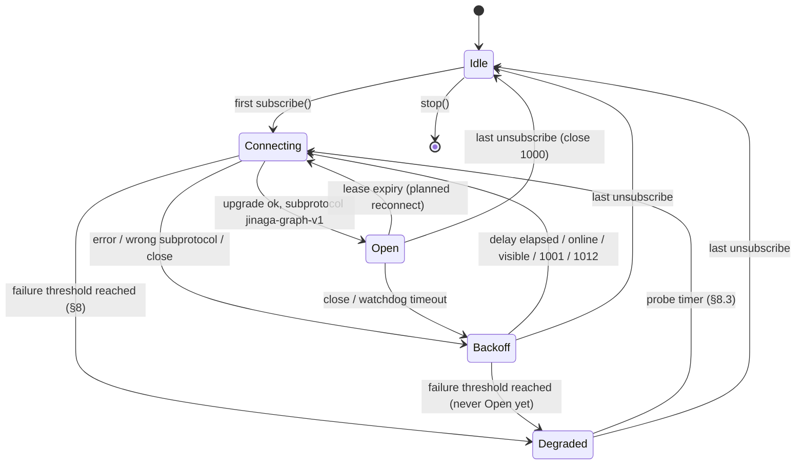

# Jinaga WebSocket Subscription Protocol — Formal Specification

Version: `jinaga-graph-v1` (draft). Status: specification for implementation; the wire
format extends the format currently implemented under `src/ws/` as described in
[`websocket-design-evaluation.md`](./websocket-design-evaluation.md) §5.

This document defines the protocol precisely enough that each requirement is
verifiable: every normative statement is tied to an invariant (§10) and every
invariant to a test obligation (§12). Correctness arguments are in §11.

Requirement keywords MUST / MUST NOT / SHOULD / MAY are per RFC 2119.

---

## 1. Overview and layering

A client multiplexes many **feed subscriptions** over a single WebSocket connection.
The server streams **facts** (in the graph format of
[`graph-protocol.md`](./graph-protocol.md)) interleaved with **control frames**.
Per-feed progress is tracked by opaque, durable **bookmarks**; a reconnect is a
stateless re-subscribe from the last persisted bookmarks.

```
┌────────────────────────────────────────────────────────┐
│ Layer 3  Subscription semantics (feeds, bookmarks)     │
│ Layer 2  Frames (SUB/UNSUB/ACK/BOOK/ERR/PING/PONG,     │
│          graph blocks)                                 │
│ Layer 1  Line stream (JSON lines, blank-line framing)  │
│ Layer 0  WebSocket (RFC 6455), text messages           │
└────────────────────────────────────────────────────────┘
```

**Byte-stream semantics (Layer 0→1).** In each direction, the logical character
stream is the concatenation of the payloads of all text messages, in order. WebSocket
message boundaries carry **no protocol meaning**: a frame MAY span messages and a
message MAY contain several frames. Receivers MUST reassemble by buffering.
Senders SHOULD align messages to frame boundaries (one frame per message) for
debuggability, but receivers MUST NOT rely on it.

Binary messages MUST NOT be sent in v1; a receiver MUST close with `4400` on
receiving one.

**Delivery model.** The protocol provides **at-least-once** delivery of facts with
**exactly-once application**, because facts are content-addressed (`(type, hash)`) and
persistence is insert-if-absent (Theorem T2). Duplicates across reconnects are
expected and harmless.

## 2. Connection establishment and negotiation

1. The client opens a WebSocket to the server's subscription endpoint
   (`{httpEndpoint with ws(s) scheme}/ws`).
2. The client MUST request subprotocol `jinaga-graph-v1` via
   `Sec-WebSocket-Protocol`. The server MUST select it. If the accepted subprotocol
   is absent or different, the client MUST close with `1002` and treat the attempt as
   a **transport failure** (§8), not a retryable network error. This guards against
   proxies that terminate WS but do not speak this protocol.
3. A connection is **Open** after a successful upgrade with the negotiated
   subprotocol. Authentication happens in-band as the first frame (§4.1).

Future protocol revisions define new subprotocol tokens (`jinaga-graph-v2`); a client
MAY offer several; the server selects the newest it supports.

## 3. Wire grammar

The grammar is given in ABNF (RFC 5234). Terminals `json-string` and `json-object`
are JSON values per RFC 8259, serialized with no embedded unescaped newlines.

```abnf
; ---- Layer 1: lines -------------------------------------------------
EOL             = [CR] LF                ; receivers accept CRLF, emit LF
blank           = EOL                    ; an empty line: frame terminator

; ---- Layer 2: the two directional streams ---------------------------
client-stream   = *client-frame
client-frame    = auth / sub / unsub / pong

server-stream   = *server-frame
server-frame    = ack / book / err / ping / graph-block

; ---- Client → server frames ------------------------------------------
auth            = %s"AUTH"   EOL token-line blank
sub             = %s"SUB"    EOL feed-line bookmark-line blank
unsub           = %s"UNSUB"  EOL feed-line blank
pong            = %s"PONG"   EOL blank

; ---- Server → client frames ------------------------------------------
ack             = %s"ACK"    EOL feed-line blank
book            = %s"BOOK"   EOL feed-line bookmark-line blank
err             = %s"ERR"    EOL feed-line code-line message-line blank
ping            = %s"PING"   EOL blank

; ---- Graph blocks (unchanged from graph-protocol.md) ------------------
graph-block     = pk-declaration / fact-block
pk-declaration  = %s"PK" pk-index EOL json-string EOL blank
fact-block      = type-line pred-line field-line *signature blank
type-line       = json-string EOL        ; fact type
pred-line       = json-object EOL        ; role → index | index[]
field-line      = json-object EOL        ; fields
signature       = %s"PK" pk-index EOL json-string EOL

; ---- Payload lines ----------------------------------------------------
feed-line       = json-string EOL        ; feed identifier (URL-safe hash)
bookmark-line   = json-string EOL        ; opaque bookmark; "" = beginning
token-line      = json-string EOL        ; bearer credential
code-line       = json-string EOL        ; error code, §6.1
message-line    = json-string EOL        ; human-readable description
pk-index        = 1*DIGIT
```

**Lexical disjointness.** The first line of every frame determines its type:

| First line matches | Frame |
|---|---|
| `AUTH`, `SUB`, `UNSUB`, `PONG`, `ACK`, `BOOK`, `ERR`, `PING` (exact) | that control frame |
| `PK` followed by digits | public-key declaration (or, inside a fact block, a signature line) |
| begins with `"` (a JSON string) | fact block |

These sets are pairwise disjoint: control keywords are unquoted; JSON strings begin
with `"`; `PK`-lines begin with `PK`. A single line of lookahead therefore suffices
(Theorem T3). Unknown all-uppercase keywords (`ALPHA` up to 16 chars alone on a line)
MUST be skipped with their payload through the next blank line — this is the v1
forward-compatibility rule for frame types added in minor revisions. Any other
unparseable line is a protocol error: close with `4400`.

**Graph block rules** (restating [`graph-protocol.md`](./graph-protocol.md), which
remains authoritative for block content):

- PK indexes are declared densely, in order (0, 1, 2, …), each before first use.
- Predecessor indexes refer to fact blocks earlier on **this connection** (indexes are
  per-connection, reset at reconnect).
- Control frames never appear inside a block; blocks are never split by frames.

## 4. Authentication and authorization

### 4.1 First-message authentication (`AUTH`)

Browsers cannot set an `Authorization` header on a WebSocket, and tokens in query
strings leak into access logs (OWASP WebSocket guidance). The protocol therefore
authenticates **in-band**, following the pattern proven by graphql-ws
(`ConnectionInit` / `connectionInitWaitTimeout`):

- The client's first frame after open MUST be `AUTH token` when it has credentials.
  The client MAY pipeline `SUB` frames immediately after `AUTH` without waiting for
  a response — silence is success; on failure the server closes with `4401` before
  processing the pipelined frames.
- If the deployment requires authentication and no `AUTH` arrives within
  `authTimeoutSeconds` (default **10 s**) of open, the server closes with `4408`.
  Deployments permitting anonymous access process `SUB` frames without `AUTH`.
- **In-band renewal**: the client MAY send `AUTH` again at any time with a fresh
  token (e.g., shortly before expiry, from `AuthenticationProvider`). The server
  rebinds the credential without dropping the connection — a long-lived connection
  never needs to churn just because a token expired. If the identity (subject)
  changes, the server MUST instead close with `4401`; subscriptions authorized for
  one identity never continue under another.
- The server derives the same `UserIdentity` an HTTP request would (in
  jinaga-server, the host app supplies a token-validation hook equivalent to its
  HTTP middleware) and binds it to the connection.
- Cookie authentication MAY be used where the app already relies on it; the server
  MUST then enforce an `Origin` allow-list at upgrade to prevent cross-site
  WebSocket hijacking. `Origin` checks are hijacking mitigation, never
  authentication.
- If credentials expire mid-connection and renewal does not occur, the server
  closes with `4401`; the client refreshes its token before reconnecting.

### 4.2 During the connection

- Every `SUB` is authorized: the server resolves the feed and enforces distribution
  rules for the bound identity (jinaga-server:
  `SubscriptionAuthorizer.feedWithDistribution` / `verifyDistributionOrIntersect`).
  Denial produces `ERR` with code `DISTRIBUTION_DENIED`; the connection stays open.
- Every fact serialized to the connection MUST be authorized for distribution to the
  bound identity under at least one active subscription (invariant S1).
- If the identity's credentials expire without in-band renewal (§4.1) and the
  deployment requires revocation, the server closes with `4401`. The client MUST
  refresh credentials (`AuthenticationProvider.reauthenticate()`) before
  reconnecting.

## 5. Frame semantics and ordering

### 5.1 SUB (client → server)

`SUB feed bookmark` requests a subscription to `feed` resuming after `bookmark`
(`""` means from the beginning). For each feed, at most one subscription exists per
connection; a `SUB` for an already-subscribed feed replaces the bookmark only if the
subscription is not yet acknowledged, otherwise it is ignored (idempotence).

Server processing order for a valid `SUB` (normative):

1. **Resolve** the feed hash to `{ specification, namedStart }` (jinaga-server:
   `FeedCache.getFeed`). Unknown → `ERR FEED_UNKNOWN`.
2. **Authorize** distribution (§4.2). Denied → `ERR DISTRIBUTION_DENIED`.
3. **Acknowledge**: send `ACK feed`. From this point until removal, the server may
   send graph blocks and `BOOK` frames for this feed (invariant W7).
4. **Attach listeners** for the feed's inverse specifications and anchor facts
   **before** the catch-up read (invariant S3). Notifications arriving during
   catch-up are queued and processed after it; duplicates are absorbed by wire-level
   dedup and store idempotence.
5. **Catch up**: page through the store from `bookmark`; for each page, send the
   facts (graph blocks, deduplicated per connection) then `BOOK feed pageBookmark`.
   Repeat until the bookmark stabilizes.
6. **Live**: on each queued or subsequent notification, send the delta's facts then
   `BOOK feed newBookmark`.

If the client's bookmark is not a valid cursor for this feed (server restored from
backup, feed re-keyed), the server sends `ERR BOOKMARK_INVALID`; the client resets its
persisted bookmark to `""` and re-subscribes.

### 5.2 UNSUB (client → server)

Removes the subscription and its listeners. The server MUST NOT initiate new frames
for the feed after processing `UNSUB`, but frames already in flight may still arrive;
the client MUST ignore frames for feeds it has no Pending/Active subscription for
(invariant C-ignore, W9 tolerance). `UNSUB` for an unknown feed is a no-op.

### 5.3 ACK (server → client)

Confirms that the subscription is validated and attached. Exactly one `ACK` per
accepted `SUB` (per connection epoch). The client uses `ACK` to resolve subscription
start-up and to arm per-feed failure handling.

### 5.4 BOOK (server → client)

`BOOK feed bookmark` asserts: *all facts required for `feed` up to `bookmark`, that
were not already covered by the client's subscribed-from bookmark, have appeared
earlier in this connection's stream* (invariant W6). Bookmarks for a feed advance
monotonically within a connection (W8) and are exactly the storage layer's cursor
values (S2) — the transport never fabricates them.

Client processing: persist all facts received so far, **then** persist the bookmark
(invariants C1/C4), then notify the local subscriber (`onResponse([], bookmark)`).

### 5.5 ERR (server → client)

`ERR feed code message` reports a per-feed failure; the connection remains open and
other feeds are unaffected. Codes and required client reactions are in §6.1. After a
fatal `ERR`, the server removes the subscription (as if `UNSUB` were received).

### 5.6 PING / PONG (liveness)

Two complementary mechanisms:

- **Protocol-level ping (RFC 6455)**: the server sends a protocol ping every
  `pingIntervalSeconds` (default **20 s**) on an otherwise idle connection. Browser
  and `ws` peers answer pongs automatically. If no pong (or any other traffic)
  arrives within `pongTimeoutSeconds` (default **30 s**) of a ping, the server MUST
  close the socket (`1011` or TCP abort) and release all subscriptions. This is the
  server's half-open detection and replaces the HTTP path's 5-minute timeout.
- **Application-level PING (server → client)**: browsers cannot observe protocol
  pings, so the server also sends a `PING` frame whenever it has sent no frame for
  `pingIntervalSeconds`. The client answers with `PONG` (which doubles as inbound
  traffic for the server's check, making protocol pings redundant where app frames
  flow). The client runs a **receive watchdog**: if no frame of any kind arrives for
  `watchdogSeconds` (default **45 s** ≈ 2×ping + margin), the client MUST assume the
  connection is dead, close it, and reconnect via §7.

The 20 s cadence is chosen to sit safely under the most aggressive common
intermediary idle timeouts (see [`websocket-deployment.md`](./websocket-deployment.md)
for the platform matrix); both values are configurable.

### 5.7 Frame ordering summary (per feed, one connection epoch)

```
SUB → ( ERR fatal )
    | ( ACK → { graph* BOOK }* → [ ERR fatal ] )      with UNSUB possible anytime
```

Graph blocks belonging to different feeds interleave freely; facts are deduplicated
per connection, so a fact "belonging" to two feeds is sent once, before the first
`BOOK` that needs it.

## 6. Errors and close codes

### 6.1 Per-feed error codes (`ERR`)

| Code | Meaning | Client reaction |
|---|---|---|
| `FEED_UNKNOWN` | Feed hash not resolvable | Fatal for feed: re-derive feeds via `feeds()` (HTTP), then re-subscribe |
| `DISTRIBUTION_DENIED` | Distribution rules deny this user | Fatal for feed: surface to observer's error path; do not retry with same identity |
| `BOOKMARK_INVALID` | Bookmark is not a valid cursor | Reset persisted bookmark to `""`, re-subscribe (once; repeated failure is fatal) |
| `INTERNAL` | Transient server failure for this feed | Retryable: re-subscribe with backoff |

Unknown codes MUST be treated as `INTERNAL` (retryable) — forward compatibility.

### 6.2 Connection close codes

Application codes use the RFC 6455 private range (4000–4999) and encode the retry
policy in the code's hundreds digit (after Pusher's protocol): **44xx = fatal with
the same inputs**, **41xx = transient, reconnect with full backoff**, **42xx =
reconnect promptly (jitter only)**. Unknown codes are classified by range — the
forward-compatibility rule for close codes.

| Code | Sender | Meaning | Client reaction |
|---|---|---|---|
| `1000` | either | Normal close (client stopped, no active feeds) | none |
| `1001` | server | Endpoint going away (scale-in) | reconnect after `random(0, cap)` |
| `1012` | server | Service restart / drain | reconnect after `random(0, cap)` — the fleet is restarting; spreading the herd matters more than latency |
| `1013` | server | Try again later | reconnect with full backoff |
| `1002` | either | WebSocket protocol error | as `4400` |
| **44xx — fatal** | | | |
| `4400` | either | Jinaga protocol violation (malformed frame, binary message, oversized frame) | do not blind-retry; count toward transport failure (§8); report |
| `4401` | server | Unauthenticated (invalid/expired token, identity change on renewal) | refresh token, then retry once; without a fresh token, surface |
| `4403` | server | Forbidden (identity may not use the WS transport) | fall back to HTTP transport (§8); do not retry WS |
| `4408` | server | Authentication timeout (no `AUTH` within `authTimeoutSeconds`, §4.1) | retry with credentials ready before connecting |
| `4413` | server | Message too big (client frame exceeded cap, §9) | do not retry; client bug |
| **41xx — transient, full backoff** | | | |
| `4100` | server | Overloaded / shedding load | full-jitter backoff |
| `4101` | server | Slow consumer (backpressure overflow, §9) | full-jitter backoff; resume covers the gap |
| `4129` | server | Too many connections/subscriptions | full-jitter backoff with doubled base |
| **42xx — reconnect promptly** | | | |
| `4200` | server | Generic "please reconnect" | immediate + small jitter |

All state needed to resume lives in the client's store (bookmarks) — every close is
recoverable by the resume path; the codes only tune *when and how* to retry.

## 7. Reconnection and resume

- **Backoff**: the first retry after a loss is fast (`random(0, 500 ms)` — most
  drops are transient blips), then full-jitter exponential:
  `delay = random(0, min(cap, base·2ⁿ))` with `base = 1 s`, `cap = 30 s`,
  `n` = consecutive failed attempts. No attempt cap. `n` resets when a connection
  has been Open for `stableSeconds` (default 30 s) or on the first `ACK` —
  never merely on open, or a flapping link churns at full speed.
- **Immediate reconnect triggers** (skip remaining delay, keep `n`): browser `online`
  event; `visibilitychange` to visible; close code `4200`. Close codes
  `1001`/`1012` reconnect after `random(0, cap)` (§6.2) so a restarting fleet is not
  met by a synchronized reconnect wave.
- **Resume**: on (re)open, the client sends `SUB` for every feed that is subscribed
  locally, using the **last persisted bookmark** of each (invariant C3). Predecessor
  and PK indexes reset with the connection; the server's dedup set also resets, so
  some facts may be re-sent — absorbed by idempotence (T2).
- **Connection lease**: the client bounds each connection's lifetime to
  `leaseSeconds` (default **50 minutes**, ±10 % jitter). At lease expiry it performs
  a planned reconnect (close `1000`, then connect and resume) — turning
  platform-imposed lifetime caps (Cloud Run 60 min, App Engine flex 1 h, Front Door
  4 h…) into graceful bookmark-resumed handoffs instead of abrupt cuts, and aligning
  with typical token TTLs. Deployments without lifetime caps MAY disable it; the
  cost of keeping it is one round trip of catch-up per cycle. See
  [`websocket-deployment.md`](./websocket-deployment.md).
- The client MUST NOT reconnect while it has no subscribed feeds, and MUST connect
  on the first subscription.

## 8. Transport selection and graceful degradation

The client maintains a transport preference per endpoint:

1. **WS preferred**: if `WebSocket` is available, try WS for `streamFeed`.
2. **Fallback trigger**: if `wsFailureThreshold` (default 3) consecutive connection
   attempts fail **before any connection reaches Open with the correct subprotocol**,
   or the server closed with `4403`, switch all feeds to the HTTP long-poll
   `streamFeed` (the existing `HttpNetwork` path, including its refresh timer).
3. **Re-probe**: while degraded, retry a WS connection every `probeIntervalSeconds`
   (default 300 s). On success, migrate feeds back to WS (HTTP streams are torn down
   after the WS subscriptions ACK — make-before-break).
4. Once a WS connection has ever been healthy on this endpoint, subsequent losses go
   through §7 backoff, **not** fallback: a broken network is not a broken transport.
5. The client SHOULD persist the last successful transport per endpoint (the
   socket.io `rememberUpgrade` pattern) so a returning client skips the failure
   dance.

`feeds()`, `fetchFeed()` (backfill), and `load()` always use HTTP regardless of the
streaming transport.

## 9. Flow control and backpressure

- **Server → client**: before writing catch-up pages, the server checks the socket's
  buffered amount. If it exceeds `highWaterMark` (default 1 MiB), the server pauses
  catch-up for that connection until drained. Live-notification deltas coalesce per
  feed while paused (only the newest pending bookmark's delta is kept — earlier facts
  are re-derivable from the store on the next page). If the buffer stays above the
  mark for `slowConsumerSeconds` (default 60 s), the server closes with `4101`.
  Disconnect — not drop — is the correct slow-consumer policy for this protocol:
  dropping frames would corrupt a feed, while a disconnected client resumes from its
  bookmarks losslessly (Theorem T1).
- **Client → server**: the client's receive loop MUST NOT buffer unboundedly; it
  stops consuming WebSocket messages while the deserializer/store pipeline is busy
  (letting TCP flow control push back on the server) rather than queueing lines
  without limit.
- **Message size**: servers SHOULD cap inbound messages (default 1 MiB, enforced
  cumulatively across fragments) — client frames are tiny; anything larger closes
  with `4413`.

## 10. State machines and invariants

### 10.1 Client connection state machine



State variables: `activeFeeds: Map<feed, {bookmark, state}>`, `attempt n`,
`epoch` (increments per Open), `lastInboundAt` (watchdog), transport preference.

### 10.2 Client per-feed state machine

```mermaid
stateDiagram-v2
    [*] --> Unsubscribed
    Unsubscribed --> Pending : subscribe → send SUB(bookmark)
    Pending --> Active : ACK
    Pending --> Failed : ERR (fatal code)
    Active --> Active : graph blocks persisted; BOOK → persist bookmark, notify
    Active --> Failed : ERR (fatal code)
    Active --> Pending : ERR INTERNAL → resubscribe (backoff)
    Pending --> Pending : connection epoch change → resend SUB(persisted bookmark)
    Active --> Pending : connection epoch change → resend SUB(persisted bookmark)
    Pending --> Unsubscribed : unsubscribe → send UNSUB (if Open)
    Active --> Unsubscribed : unsubscribe → send UNSUB
    Failed --> Unsubscribed : unsubscribe / error surfaced
    Failed --> Pending : BOOKMARK_INVALID → reset bookmark, resubscribe once
```



Frames referencing feeds in `Unsubscribed`/`Failed` are ignored (UNSUB race
tolerance).

### 10.3 Server connection state machine

```mermaid
stateDiagram-v2
    [*] --> Upgrading
    Upgrading --> Open : subprotocol selected
    Open --> Open : AUTH binds/renews identity; SUB/UNSUB/PONG processed; pings on schedule
    Open --> Closed : AUTH invalid → 4401 / auth timeout → 4408
    Open --> Draining : SIGTERM / deploy → close 1012, staggered across connections
    Open --> Closed : pong timeout / protocol error 4400 / slow consumer 4101 / client close
    Draining --> Closed : socket closed or grace period elapsed
    Closed --> [*] : all listeners removed (S4)
```



Connection context: bound `UserIdentity`, `subscriptions: Map<feed, SubState>`,
per-connection serializer state (fact index map, PK index map = dedup sets),
`bufferedAmount` watermark state, ping timer.

### 10.4 Server per-subscription state machine

```mermaid
stateDiagram-v2
    [*] --> Validating : SUB received
    Validating --> Denied : unknown feed / distribution denied → ERR, remove
    Validating --> CatchingUp : ACK sent, listeners attached (S3)
    CatchingUp --> CatchingUp : page → graph* + BOOK (bookmark advances)
    CatchingUp --> Live : bookmark stable; replay queued notifications
    Live --> Live : notification → graph* + BOOK
    CatchingUp --> Removed : UNSUB / connection closed → detach listeners
    Live --> Removed : UNSUB / connection closed → detach listeners
    Denied --> [*]
    Removed --> [*]
```



### 10.5 Invariants

**Wire invariants** (checkable by observing one direction of one connection):

- **W1 (Prefix parseability).** Every finite prefix of the logical stream parses to a
  sequence of complete frames plus at most one incomplete trailing frame.
- **W2 (Determinism).** The first line of a frame uniquely determines its production
  in the grammar (§3 lexical disjointness).
- **W3 (PK density).** The k-th `pk-declaration` on a connection carries index k−1;
  every `PK` reference is to an already-declared index.
- **W4 (Topological order).** Every predecessor index in a fact block is the index of
  an earlier fact block on the connection.
- **W5 (Wire dedup).** No two fact blocks on one connection have the same
  `(type, hash)`.
- **W6 (Facts before BOOK).** For every `BOOK f b`: every fact in the feed-delta of
  `f` from the subscription's starting bookmark to `b` appears as a fact block
  earlier in the stream.
- **W7 (ACK first).** For each subscription epoch of feed f, `ACK f` precedes every
  graph block sent on behalf of f and every `BOOK f _`; only `ERR f _` may occur
  instead.
- **W8 (Bookmark monotonicity).** Within a subscription epoch, successive `BOOK f bᵢ`
  carry strictly advancing store cursors.
- **W9 (Relevance).** The server emits `ACK`/`BOOK`/`ERR` only for feeds with a
  subscription in {Validating, CatchingUp, Live} (frames in flight across an `UNSUB`
  are excused; the client ignores them).
- **W10 (Ping cadence).** While Open, the gap between consecutive server frames
  (any type) never exceeds `pingIntervalSeconds` + scheduling slack.

**Client-state invariants:**

- **C1 (Persist before advance).** The client persists a bookmark `b` for feed `f`
  only after every fact received before the corresponding `BOOK f b` has been
  persisted to the store.
- **C2 (No regression).** The persisted bookmark of a feed never moves backward,
  except to `""` on `BOOKMARK_INVALID`.
- **C3 (Faithful resume).** On each connection epoch, the client sends exactly one
  `SUB f b` for every locally subscribed feed f, where b is f's persisted bookmark.
- **C4 (Receive-order barrier).** Fact persistence and bookmark persistence for a
  connection are applied in stream order (a `BOOK` never overtakes the facts that
  preceded it).

**Server-state invariants:**

- **S1 (Authorized distribution).** Every fact block sent is authorized for the
  connection's bound identity under some subscription in {CatchingUp, Live} at send
  time.
- **S2 (Honest bookmarks).** Every bookmark in a `BOOK` is a cursor value returned by
  the storage layer for that feed; the transport never synthesizes bookmarks.
- **S3 (Listeners before read).** Inverse and anchor listeners are attached before
  the catch-up read begins; notifications during catch-up are queued, not dropped.
- **S4 (No leaks).** When a subscription reaches Removed/Denied, or the connection
  reaches Closed, all listeners attached for it are removed; when a connection
  closes, its dedup sets and buffers are released.

**Liveness properties** (under fairness: messages sent on a live connection are
eventually delivered; the store eventually serves reads):

- **L1.** Every `SUB` on a connection that stays Open is answered by `ACK` or `ERR`.
- **L2.** Every fact saved at the server that matches a Live subscription is
  eventually followed on the connection by that fact and a `BOOK` covering it — or
  the connection closes.
- **L3.** A half-open connection is detected within `pongTimeoutSeconds` +
  `pingIntervalSeconds` by the server and within `watchdogSeconds` by the client.
- **L4 (Eventual delivery).** Across arbitrary connect/disconnect sequences, every
  fact in a subscribed feed is eventually persisted at the client, provided the
  client retries indefinitely (§7) and the server remains available infinitely often.

## 11. Correctness arguments

**Theorem T1 (No lost facts).** *Under W6, W8, S2, S3, C1–C4, every fact in a
subscribed feed's delta is eventually persisted by the client (L4).*

*Proof sketch.* Consider feed f with persisted client bookmark b₀. By C3, each
connection epoch opens with `SUB f b₀`. By S2 and W8 the server's `BOOK` sequence
b₁ < b₂ < … enumerates store cursors; by W6 all facts in (b₀, bᵢ] precede `BOOK f bᵢ`
on the wire. By C4/C1 the client persists those facts before persisting bᵢ, so at
every moment the persisted bookmark under-approximates persisted facts. Failure
cases: (i) crash after facts persisted, before bookmark persisted — next epoch resumes
from b₀ and re-receives the facts; duplicates absorbed (T2); (ii) crash mid-block —
the partial block was never persisted and is re-sent; (iii) missed live notification
impossible while Live by S3 (listeners precede the read, queue during catch-up);
(iv) connection loss anywhere — reduces to case (i) by induction on epochs, which
terminates because each epoch either advances the persisted bookmark (finite delta by
T4) or the retry discipline (§7) starts a new epoch. ∎

**Theorem T2 (Exactly-once application).** *Facts are applied to the client store at
most once, hence delivery is effectively exactly-once.*

*Proof sketch.* A fact's identity is `(type, hash)` where hash is recomputed from
content on deserialization (`computeHash`), so identity is content-derived and
transport-independent. Store `save` is insert-if-absent on that key, merging only
signatures. Within one connection W5 already prevents duplicates; across connections
re-sends hit the insert-if-absent guard. Observer notification fires only for facts
the store reports as newly added, so downstream effects also occur once. ∎

**Theorem T3 (Deterministic single-pass parsing).** *The grammar of §3 is parseable
by a deterministic single-pass line reader with one line of lookahead, and W1 holds.*

*Proof sketch.* Frame type is decided by the first line (W2, lexical disjointness).
Each production is a fixed count of lines terminated by a blank line except
`fact-block`'s `*signature`, disambiguated line-by-line: after the field line, a line
starting `PK` is a signature, a blank line ends the block. No production is a prefix
of another with the same first line. Buffering until the terminating blank line gives
W1: incomplete input is exactly one partial frame retained in the buffer. ∎

**Theorem T4 (Catch-up terminates).** *For a fixed store state, the CatchingUp phase
of a subscription completes in finitely many pages.*

*Proof sketch.* The delta between the subscribed bookmark and the store's current
head is finite. Each page either strictly advances the cursor (W8/S2, so progress in
a finite chain) or returns an unchanged bookmark, which is the exit condition. Saves
that occur during catch-up are handled by queued notifications (S3) after the phase
exits, so they cannot extend it unboundedly. A page-count backstop (as in the HTTP
path's 1000-page cap) turns pathological store behavior into `ERR INTERNAL` rather
than an infinite loop. ∎

**Theorem T5 (No resource leaks).** *Every listener attached by a subscription is
detached in finite time after the subscription ends.*

*Proof sketch.* Listeners are attached only in Validating→CatchingUp (S3). Every
path out of CatchingUp/Live (UNSUB, fatal ERR, connection close) runs the detach
(S4). Connection death without a close frame is detected by L3 (server pong timeout),
which triggers the same close path. Hence the leak window is bounded by
`pingIntervalSeconds + pongTimeoutSeconds`. This is the property whose absence caused
the production incident in issue #127. ∎

**Theorem T6 (Bounded staleness).** *While a connection is Open and healthy, a fact
saved at the server for a Live feed is visible to the client within notification +
serialization + one round trip; there is no polling interval in the latency path.*
Follows from L2 with the push pipeline; the periodic-refresh path is eliminated for
WS transports (core change C1 in the implementation plan).

## 12. Conformance test obligations

Every invariant maps to at least one required test (detailed in
[`websocket-implementation-plan.md`](./websocket-implementation-plan.md)):

| Invariant | Test obligation (summary) |
|---|---|
| W1/W2/T3 | Parser golden tests; fuzzed chunk-boundary re-splits of valid streams; property test: parse(concat(chunks)) independent of chunking |
| W3–W5 | Serializer round-trip + duplicate-fact injection across feeds |
| W6/C1/C4 | Interleaving test: BOOK withheld until dependent facts persisted; crash-injection between save and saveBookmark |
| W7 | Server unit: no graph/BOOK before ACK per subscription |
| W8/S2 | Bookmark sequence strictly advancing; equals store cursors |
| W9 | UNSUB race: late frames ignored without error |
| W10/L3 | Fake-timer tests: ping cadence, watchdog fires, server reaps dead peer |
| C2 | Reconnect storm property test: persisted bookmark monotone |
| C3 | Reconnect resends exactly the subscribed set with persisted bookmarks |
| §4.1 | AUTH-first ordering; auth timeout → 4408; in-band renewal keeps connection; identity change → 4401 |
| S1 | Distribution-denied feed never leaks facts (negative test) |
| S3/L2 | Save during catch-up is delivered (no-gap test) |
| S4/T5 | Listener count returns to baseline after UNSUB/close/kill |
| L1 | Every SUB answered under fault injection |
| T1/T2/L4 | End-to-end chaos test: random disconnects, duplicate delivery, final store equality |
| T4 | Multi-page catch-up terminates; page-cap produces ERR INTERNAL |
| §6 | Close-code matrix: client reaction per code and per range class (token refresh on 4401, fallback on 4403, backoff on 41xx, prompt on 42xx, unknown codes by range) |
| §8 | Transport fallback: N failures → HTTP; probe migrates back; healthy-loss ≠ fallback |
| §9 | Slow-consumer: catch-up pauses at watermark; 4101 after deadline; client resumes losslessly |

---

*Related documents:*
[`graph-protocol.md`](./graph-protocol.md) (graph block format, authoritative),
[`websocket-design-evaluation.md`](./websocket-design-evaluation.md) (rationale),
[`websocket-implementation-plan.md`](./websocket-implementation-plan.md) (TDD plan),
[`websocket-deployment.md`](./websocket-deployment.md) (cloud platform guidance).
